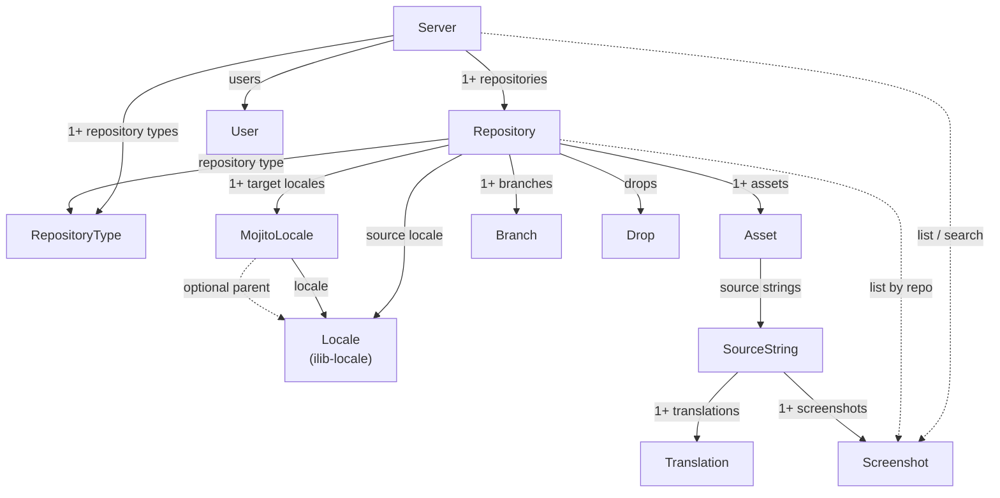

# Mojito SDK architecture

`mojito-sdk` is a TypeScript client for the Mojito translation management
system. It is built as three stacked layers plus a separate authentication
session. Applications should use the top layer. The layers below exist so that
layer can stay small, named in product language, and stable while Mojito’s HTTP
API changes.

```
Application code
        │
        ▼
┌─────────────────────────────────────────┐
│  Object model                           │  src/model/
│  Server, Repository, Drop, Asset,       │
│  SourceString, Translation, …           │
└─────────────────────────────────────────┘
        │  uses DTO types; never reimplements HTTP
        ▼
┌─────────────────────────────────────────┐
│  Generated DTOs                         │  src/generated/openapi.ts
│  Exact OpenAPI request/response shapes  │  from openapi/openapi.json
└─────────────────────────────────────────┘
        │  passed through
        ▼
┌─────────────────────────────────────────┐
│  Transport                              │  src/lowlevel/
│  LowLevelClient.call(operationId, …)    │  OPERATIONS registry
│  fetch + JSON marshalling               │
└─────────────────────────────────────────┘
        │
        ▼
   Mojito HTTP API

Auth (src/auth/) sits beside transport: it supplies cookies or headers for
every request. It is not part of the object model.
```

The public contract of this package is the object model. A new OpenAPI
operation, schema, or DTO field does **not** automatically become a public
method or type.

Resource names, methods, and compatibility rules for the top layer are
documented in [`object-model.md`](object-model.md).

## Object model design rules

These rules apply to every type in `src/model/`. They are the bar for the
published API. Application code constructs a `MojitoClient`, obtains the
`Server`, and works with the domain objects that container returns.

1. **Object model only.** Clients of this library see the object model layer.
   They construct `MojitoClient` and domain objects. They do not construct
   transport, generated DTO, or auth-provider instances.

2. **Published surface is this layer.** The package entrypoint and generated
   API docs export the object model (plus version helpers). Lower layers stay
   in this maintainer document and in source that is not part of the public
   entrypoint. `MojitoHttpError` is exported so callers can catch HTTP failures
   from object-model methods.

3. **Session lives on `MojitoClient`.** Every object-model class takes a
   `MojitoClient` in its constructor and stores it. That instance is how the
   object reaches HTTP, settings, and session state. `Server` is obtained from
   the client (`client.server` / `getServer()`); there is one server per
   client session.

4. **One session argument.** Object-model methods take domain parameters (ids,
   names, content, `ilib-locale` objects). Callers do not pass `MojitoClient`
   into ordinary methods — the subject already holds the session. Methods do
   not take transport, auth, or DTO classes, and they do not repeat connection
   or session fields that already live on `MojitoClient`.

5. **Instance is the subject.** A constructed object represents one resource.
   Instance methods read or change that resource.

6. **Collections always belong to the container.** There are no static
   collection or factory methods on resource classes. List, find, get, and
   create live on the object that owns the collection:

   - `Server` owns top-level collections: repositories, repository types,
     users, global screenshots search, cross-repo source-string search, and
     server-scoped ops (session check, DB latency, …).
   - `Repository` owns assets, branches, drops (and convenience screenshot
     filters for that repo).
   - `Asset` owns source strings.
   - `SourceString` owns translations and screenshots.

   Prefer `server.repositories()` / `server.findRepository(name)` over
   `Repository.list(client)`.

### `MojitoClient` vs `Server`

Keep them separate:

| Type | Role |
|------|------|
| `MojitoClient` | Session and transport: host, auth, `call`, version helpers. Not a domain container. |
| `Server` | Domain root for one Mojito instance. Collections and whole-server actions. |

Do **not** merge them. Mixing transport/`call` with every top-level collection
turns the client into a god object and blurs “session” vs “what this Mojito
contains.” Callers write:

```ts
const client = new MojitoClient(/* … */);
const server = client.server; // or client.getServer()
const repos = await server.repositories();
```

`Server` holds a reference to the same `MojitoClient` as every other model
object. Future whole-server automation (for example fan-out AI translate)
belongs on `Server`, not on `MojitoClient`.

## 1. Object model

The object model is a hand-designed domain API. Names describe what a
localization engineer thinks about, not Spring controller tags.

| Public type | Meaning |
|-------------|---------|
| `MojitoClient` | Session: connection, auth, and `call` |
| `Server` | One Mojito instance; root container for top-level collections |
| `Repository` | A translation project |
| `RepositoryType` | Shared configuration a repository can use |
| `Drop` | A vendor translation batch |
| `Asset` | A source file (or virtual source asset) in a repository |
| `Branch` | A content branch on a repository |
| `SourceString` | One source-language string (`TMTextUnit` on the wire) |
| `Translation` | That string in one locale (`TMTextUnitVariant` on the wire) |
| `Screenshot` | Visual context for translators |
| `MojitoLocale` | A repository locale and its Mojito inheritance configuration |
| `User` | An account (`server.me()` for the authenticated profile) |

Integrity checkers are **not** domain objects. They are configuration data on
`RepositoryType` (and similarly on assets in the wire API): each entry is an
extension plus a checker type (`MESSAGE_FORMAT`, `PRINTF_LIKE`, …). Running a
check is a method that returns a result value, not a long-lived resource. Do
not introduce an `IntegrityCheck` class.

### Object containment hierarchy

Solid arrows show containment or an owned collection. `1+` means one or more.
Dashed arrows show an optional reference or a convenience listing that is not
ownership. Every object-model instance also stores the same `MojitoClient`
session; those session references are omitted for clarity.

A source locale is a plain `Locale` from `ilib-locale`, not a separate class.



`MojitoClient` is outside this diagram: it is the session, not a contained
resource. Callers reach `Server` from the client.

**Translations.** A `SourceString` owns many `Translation`s — typically one
current translation per target locale. Collection access belongs on
`SourceString` (for example `translations()`), not as a top-level static list.

**Translation history.** Mojito stores each past wording as another
`TMTextUnitVariant`. That is the same wire type as a current `Translation`,
not a separate history resource. Model history as a **method that returns
`Translation[]`** for one locale (today: `SourceString.getTranslationHistory`),
ordered oldest→newest or newest→oldest as the API returns. Do not add a
`TranslationHistory` or `Revision` class unless history rows need behavior that
current translations do not share. Enrich `Translation` with fields the history
DTO already has (`createdDate`, `createdByUser`, variant comments) when callers
need them; those fields are simply often unset on “current” search rows.

**Screenshots.** Ownership is `SourceString` → `Screenshot`.
`Repository.screenshots()` is a convenience filter across the repo (dashed
edge); it does not mean the repository owns screenshots in the object model.

Plain locales are instances of `Locale` from the `ilib-locale` package. The
SDK does not define another fundamental locale class. `MojitoLocale` wraps an
ilib `Locale` only where Mojito adds repository-specific behavior. It
represents exactly one of these states:

- fully translated, with no inheritance;
- inherited from an explicit parent locale; or
- inherited without a parent, meaning inherited from the repository source
  locale.

`Repository.getLocales()` and `Repository.setLocales()` read and replace the
repository's `MojitoLocale` entries. `Repository.getSourceLocale()` and
`Repository.setSourceLocale()` use a plain ilib `Locale`, because a source
locale does not inherit.

Actions are methods, not extra types. Per-string AI translation lives on
`SourceString` (`translateWithAi`); repository-scoped AI translate belongs on
`Repository`; whole-server fan-out (when automated) belongs on `Server`. AI
review lives on `Translation` (`reviewWithAi`). Localizing a file lives on
`Asset` (`localize`, `pseudoLocalize`, `importLocalized`).

Long-running Mojito jobs are **not** first-class objects. `PollableTask` is an
implementation detail of the HTTP API. Public methods return `Promise`s, poll
internally, honor `AbortSignal` / timeout options, and throw if the job reports
`errorMessage`. A JavaScript Promise still only covers “this process waits”;
the server job can outlive the client.

Unknown optional parameters are forwarded to Mojito so callers can use newer
backend fields without an SDK bump.

Asset identity on the server is **repository + path** (and optionally branch),
not a local file. Pushing source content is an upsert on that path
(`importSourceAsset`). The object model does not yet wrap that create/find
flow; until it does, `Repository.assets({ path })` lists existing assets and
`MojitoClient.call("importSourceAsset", …)` is the escape hatch.

`Repository.repositoryType` is modeled even though the current OpenAPI
`Repository` schema has no `repoType` field yet. When Mojito starts returning
the link, the getter can be filled from the DTO without renaming the public
API.

## 2. Generated DTOs

DTOs are TypeScript types generated from the cached OpenAPI document with
[`openapi-typescript`](https://github.com/openapi-ts/openapi-typescript). They
describe JSON on the wire and have no methods.

Why this generator: the SDK already owns HTTP (`LowLevelClient`). A full
OpenAPI client generator would duplicate transport and leak controller-shaped
`*Api` classes into the public surface. `openapi-typescript` emits types only,
with no runtime dependency.

Output lives at `src/generated/openapi.ts` and is **not** part of the package
entrypoint. Springdoc produces hundreds of schemas, including HAL projections
(`Repository_Repository`, `Drop_DropSummary`, `PageDrop_DropSummary`, …). Those
are useful for typing a particular response and are noise if published as the
SDK’s object model.

The object model maps a few of those shapes onto domain types, for example:

| Domain type | Typical DTO |
|-------------|-------------|
| `Repository` | `Repository_Repository` |
| `RepositoryType` | `RepoType_RepoType` |
| `Drop` | `Drop_DropSummary` |
| `SourceString` | `TextUnitDTO` |
| `Translation` | `TMTextUnitVariant` (and search-row fields on `TextUnitDTO`) |
| `Asset` | `Asset` |
| ilib `Locale` | `Locale` |
| `MojitoLocale` | `RepositoryLocale` |

Hand-written public parameter types (`AssetLocalizeParams`,
`DropExportParams`, …) sit in front of those DTOs so callers do not have to
speak Mojito’s path names (`localeId`, `tmTextUnitIds`, `screenshotName`) or
pass locale tags instead of ilib `Locale` instances.

## 3. Transport

`LowLevelClient` is the HTTP layer. It does not know about `Drop` or
`SourceString`. It knows OpenAPI `operationId`s.

`src/lowlevel/spec-meta.ts` is generated from the same `openapi.json`: method,
path, tags, path/query parameters, and whether the operation has a body. A
call looks like:

```ts
await client.call("getDrops", { repositoryId, pageable });
await client.call("exportDrop", { body: params });
```

The client fills path segments, query string, and JSON body, sends `fetch`,
attaches auth, unpacks JSON, and throws `MojitoHttpError` on non-success
status. Leftover unknown keys are forwarded as query parameters or merged into
the body.

`MojitoClient.call(operationId, params)` is the documented escape hatch for
operations the object model has not wrapped.

Auth is loaded from the same `~/.l10n/config/cli` properties as the Mojito
CLI (`l10n.resttemplate.*`), or from explicit `MojitoClient` options.
**STATEFUL** mode does form login plus CSRF and session cookies. **HEADER**
mode attaches static headers. Credential handling stays out of generated code.

Small helpers under `src/internal/` (locale-id lookup, poll-until-finished)
are used by the object model and are not public.

## Generation

The cached spec is `openapi/openapi.json`, fetched with `mojito api --spec`.

| Script | What it does |
|--------|----------------|
| `generate:openapi` | Fetch and write `openapi/openapi.json` |
| `generate:types` | Regenerate `src/generated/openapi.ts` |
| `generate:operations` | Regenerate `src/lowlevel/spec-meta.ts` |
| `generate:code` | Types + operations |
| `generate` | Fetch spec, then regenerate code |

After regeneration, update the object model only when a **product workflow**
needs it: add methods and types in a minor release; deprecate before removing
anything public.

## Versioning

`mojito-sdk` has two version numbers. They move independently.

**SDK package version** (`getSdkVersion()`) is this npm package’s semver.
Breaking the object model requires a major SDK release. Regenerating DTOs or
the operation table for additive spec changes does not.

**Mojito version this SDK was built for** (`getMojitoVersion()`) comes from
`info.version` in the cached `openapi/openapi.json` at generation time. That
is the Mojito HTTP API this build knows. `getOpenApiSpecVersion()` returns the
same string.

This SDK can call any Mojito whose version satisfies the npm **caret** range of
that Mojito version: `^` plus `getMojitoVersion()`. If this SDK was generated
against Mojito `3.4.5`, it can call Mojito versions that match `^3.4.5`, which
is `>=3.4.5 <4.0.0`. Mojito `4.x` is out of range. Any Mojito older than
`3.4.5` is out of range.

`getCompatibleMojitoRange()` returns that caret string.
`isCompatibleMojitoVersion(version)` tests a live Mojito version against it.
`getApiInfo()` includes the Mojito version, the caret range, the spec hash,
and the SDK version.

The cached spec’s `info.version` is currently `v0`. `getMojitoVersion()`
returns that string until Mojito publishes a product semver in the OpenAPI
document.

## Source layout

```text
packages/mojito-sdk/
  openapi/openapi.json     cached Mojito OpenAPI document
  src/model/               public object model
  src/generated/openapi.ts generated DTO types
  src/lowlevel/            transport + operation registry
  src/auth/                CLI-compatible session auth
  src/internal/            poll-until-done, locale resolution
  src/index.ts             object model + version helpers + MojitoHttpError
```
